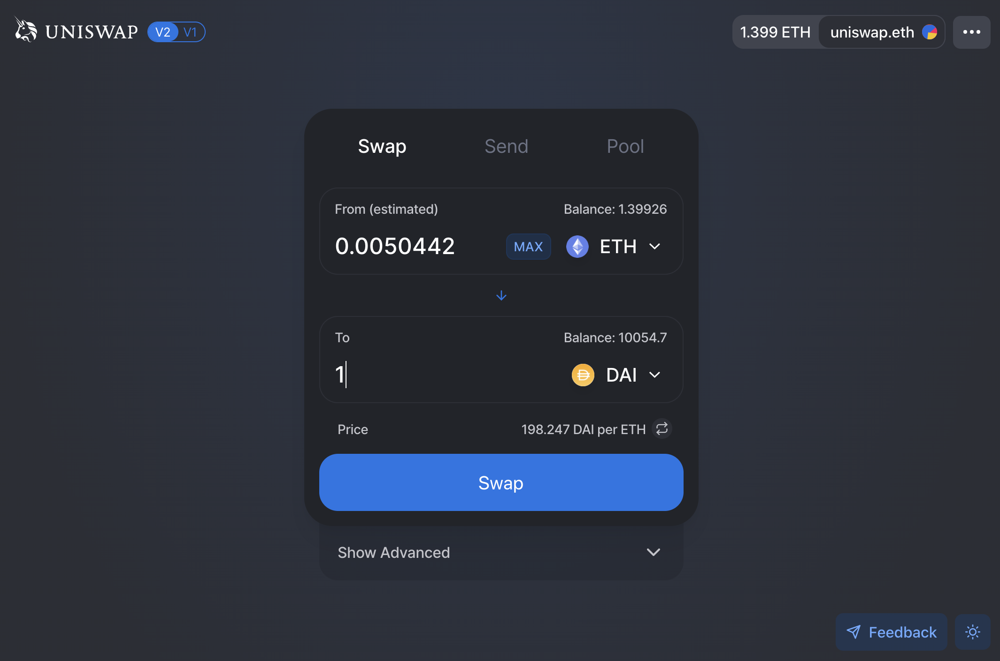
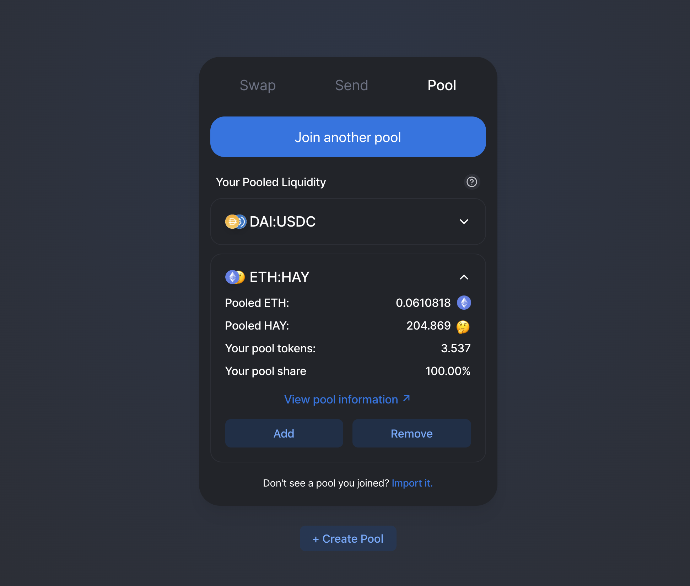

Valueswap V2, the second iteration of the Valueswap protocol, has been [deployed to the Ethereum mainnet](https://etherscan.io/address/0x1f2b12Ef34ca629341F2F77440F0a55a115C86cB#code)!

An [audit report and formal verification](https://valueswap.valuenetwork.live/audit.html) has already been released and the [Valueswap V2 Bug Bounty](https://twitter.com/ValueswapProtocol/status/1250474233131495424) has been running for over a month.

Developers can begin building on Valueswap V2 immediately! Initial [docs](http://valueswap.valuenetwork.live/docs/v2) and [example projects](http://github.com/valuenetworklive2021/valueswap-v2-periphery/tree/master/contracts/examples) are already available.

Today, the following open source projects are also being released:

- A [migration portal](https://migrate.app.valueswap.valuenetwork.live/) for moving liquidity from Valueswap V1 to Valueswap V2
- An updated [interface](https://app.valueswap.valuenetwork.live/) for swapping and liquidity provision on Valueswap V2
- An updated [info site](https://info.valueswap.valuenetwork.live/) for Valueswap V2 analytics

Valueswap V2 has many new features and technical improvements compared with Valueswap V1 including:

- ERC20 / ERC20 Pairs
- Price Oracles
- Flash Swaps
- And much more!

For full details on the benefits of Valueswap V2 for liquidity providers and traders, please read the Valueswap V2 [announcement blog post](https://valueswap.valuenetwork.live/blog/valueswap-v2). For more information on the launch please read below.

## Liquidity Migration

The [migration portal](https://migrate.vapp.valueswap.valuenetwork.live/) makes the process of withdrawing liquidity from Valueswap V1 and depositing it into Valueswap V2 fast and simple.

This portal is only for Valueswap V1 liquidity providers. If you are not a Valueswap V1 liquidity provider but wish to use Valueswap V2, you can do so from the [updated interface](https://app.valueswap.valuenetwork.live/).

## Updated Interface

The open source [interface](https://app.valueswap.valuenetwork.live/) has been updated to work with Valueswap V2!

It now supports creating and providing liquidity in ERC20 / ERC20 pairs, such as DAI/USDC.

Swapping logic has been updated to properly route between ERC20 / ERC20 pairs.

While Valueswap V2 uses WETH, this is abstracted in the interface and ETH can be used directly.

#### Swapping

#### Liquidity Provision

#### Pool Creation

## Info Site

Valueswap V2 analytics are available at [info.valueswap.valuenetwork.live](http://info.valueswap.valuenetwork.live/), built on top of the open source [Valueswap V2 subgraph](https://github.com/valuenetworklive2021/valueswap-v2-subgraph).

## What will happen to Valueswap V1

Valueswap V1 is an automated, decentralized set of smart contracts. It will continue functioning for as long as Ethereum exists.

## All other questions

For all questions, you can join and engage with the community in the [Valueswap Discord](https://discord.gg/XErMcTq).
