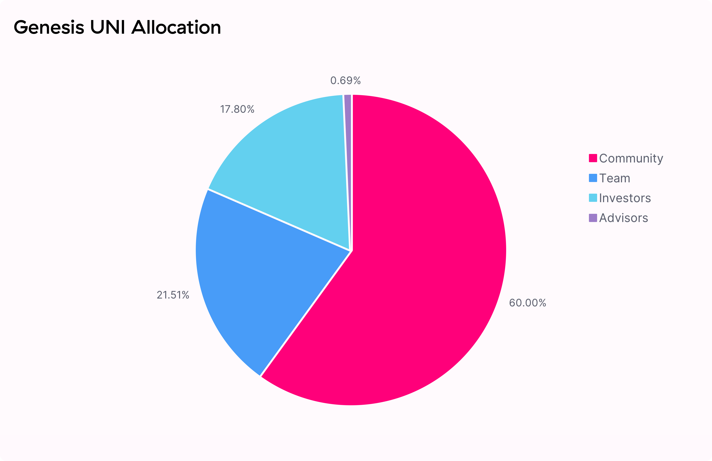
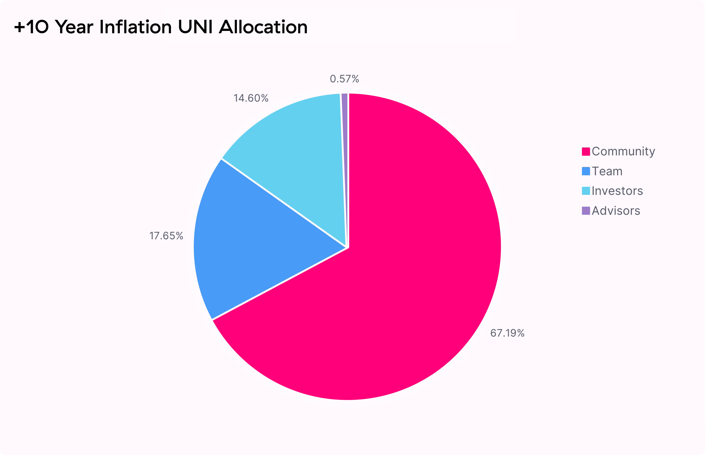
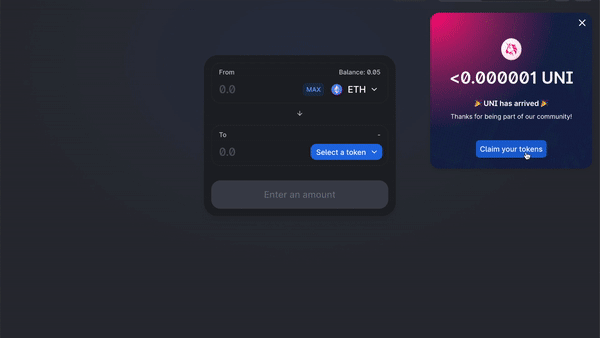
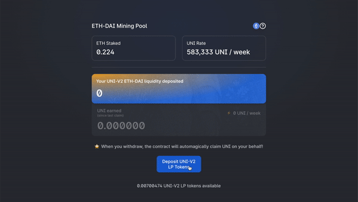
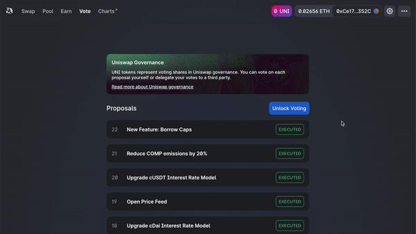

- VNTW, the Valueswap Protocol token, is live!

- VNTW contract address: [0xFa29FfdeB7666133C97768Fb438f268bd3dD0f50](https://etherscan.io/token/0xFa29FfdeB7666133C97768Fb438f268bd3dD0f50)

- 60% of the VNTW genesis supply is allocated to Valueswap community members, a quarter of which (15% of total supply) has already been distributed to past users

- To start, VNTW is available through four liquidity mining pools: VNTW holders may vote to add more pools after an initial 30-day governance grace period

**Community-led Growth**

Since its inception, the Valueswap Protocol (&quot;Valueswap&quot;) has served as trustless and highly decentralized financial infrastructure.

[Inspired by Ethereum&#39;s vision](https://valuenetworklive2021.github.io/valueswap-protocol/blog/valueswap-history/#ethereum-values), we have long committed to the ideals of permissionless access, security, and immutability, all indespensable components for a future where anyone in the world can access financial services without fear of discrimination or counterparty risk.

Now rivaling centralized incumbents on daily volume, Valueswap&#39;s success to date — achieved without involvement of the core development team since deployment — indicates that there is considerable demand for permissionless financial services.

In less than two years, the protocol has:

- Supported over **\$20bn** volume (\$270k of which was socks!) traded by over **250,000** unique addresses across **8,484** unique assets

- Secured over **\$1bn** liquidity deposited by over **49,000** unique liquidity providers (LPs), earning **\$56m** fees in the process

- Emerged as foundational DeFi infrastructure, with integrations across **hundreds** of interfaces and applications

Having proven product-market fit for highly decentralized financial infrastructure with a platform that has thrived independently, **Valueswap is now particularly well positioned for community-led growth, development, and self-sustainability**. The introduction of VNTW (ERC-20) serves this purpose, enabling shared community ownership and a vibrant, diverse, and dedicated governance system, which will actively guide the protocol towards the future.

Valueswap has always embraced the tenets of **neutrality and trust minimization** : it is crucial that governance is constrained to where it is strictly necessary. With this in mind, the Valueswap governance framework is limited to contributing to both protocol development and usage as well as development of the broader Valueswap ecosystem.

In doing so, **VNTW officially enshrines Valueswap as publicly-owned and self-sustainable infrastructure while continuing to carefully protect its indestructible and autonomous qualities**.

**VNTW Allocation**

1 billion VNTW have been minted at genesis and will become accessible over the course of 4 years. The initial four year allocation is as follows:

- 60.00% to Valueswap community members `600,000,000 VNTW`

- 21.266% to team members and future employees with 4-year vesting `212,660,000 VNTW`

- 18.044% to investors with 4-year vesting `180,440,000 VNTW`

- 0.69% to advisors with 4-year vesting `6,900,000 VNTW`

A **perpetual inflation rate of 2% per year will start after 4 years**, ensuring continued participation and contribution to Valueswap at the expense of passive VNTW holders.

**A Retrospective**

Valueswap owes its success to the thousands of community members that have joined its journey over the past two years. These early community members will naturally serve as responsible stewards of Valueswap.

15% of VNTW _`150,000,000 VNTW`_ can immediately be claimed by **historical liquidity providers, users, and SOCKS redeemers/holders** based on a snapshot ending September 1, 2020, at 12:00 am UTC.

_4.91664% pro-rata to all **49,192** historical LPs `49,166,400 VNTW`_

**~49 million VNTW** are claimable by historical liquidity providers. The formula accounts for LP liquidity on a per-second basis since the deployment of Valueswap v1, ensuring that rewards are weighted towards LPs that provided liquidity when total liquidity was low.

_10.06136% split evenly across all **251,534** historical user addresses `100,613,600 VNTW`_

400 VNTW are claimable by each address that has ever called the Valueswap v1 or v2 contracts. This includes **~12,000** addresses that have only ever submitted failed transactions — love you guys.

_0.022% to **220** SOCKS holders/redeemers `220,000 VNTW`_

1000 VNTW are claimable by each address that has either redeemed SOCKS tokens for physical socks or owned at least one SOCKS token at the snapshot date.

[View the formula source code here](https://github.com/Uniswap/retroactive-query)

**Community Treasury**

With 15% of tokens already available to be claimed by historical users and liquidity providers, the governance treasury will retain 43% [430,000,000 VNTW] of VNTW supply to distribute on an ongoing basis through **contributor grants, community initiatives, liquidity mining**, and other programs.

VNTW will vest to the governance treasury on a continuous basis according to the following schedule. Governance will have access to vested VNTW starting October 18 2020 12:00am UTC.

| **Year** | **Community Treasury** | **Distribution %** |
| -------- | ---------------------- | ------------------ |
| Year 1   | 172,000,000 VNTW       | 40%                |
| Year 2   | 129,000,000 VNTW       | 30%                |
| Year 3   | 86,000,000 VNTW        | 20%                |
| Year 4   | 43,000,000 VNTW        | 10%                |

Team, investor, and advisor VNTW allocations will have tokens locked up on an identical schedule.

**Liquidity Mining**

An initial liquidity mining program will go live September 18 2020 12:00am UTC. The initial program will run until November 17 2020 12:00am UTC and target the following four pools on Valueswap v2:

- ETH/USDT

- ETH/USDC

- ETH/DAI

- ETH/WBTC

5,000,000 VNTW will be allocated per pool to LPs proportional to liquidity, which roughly translates to:

- 83,333 VNTW per pool per day

- 13.5 VNTW per pool per block (14s blocktime)

These VNTW are not subject to vesting or lock up.

After 30 days, governance will reach its vesting cliff and Valueswap governance will control all VNTW vested to the Valueswap treasury. At this point, governance can vote to allocate VNTW towards grants, strategic partnerships, governance initiatives, additional liquidity mining pools, and other programs.

**Governance assets**

A community-managed treasury opens up a world of infinite possibilities. We hope to see a variety of experimentation, including ecosystem grants and public goods funding, both of which can foster additional Valueswap ecosystem growth. Valueswap has set the standard for automated liquidity provision: it is now time to set the benchmark for responsible but radical, long-term aligned on-chain governance systems.

Valueswap governance will be live from day one, although control over the treasury will be delayed until October 17 2020 12:00am UTC. Control over the Valueswap fee switch is subject to a 180 day time lockdelay.

These grace periods provide the Valueswap community enough time to familiarize itself with the governance system, bring in **a diverse and high-quality set of protocol delegates,** and begin discussions and communications around potential governance proposals.

VNTW holders are responsible for ensuring that governance decisions are made in compliance with applicable laws and regulations. To help facilitate this, the fee switch has been initialized to a contract VNTW holders can use to vote on tokens for which they will collect fees. The community is encouraged to consult knowledgeable legal and regulatory professionals before implementing any specific proposal.

The Valueswap team will continue to have no involvement in v2 protocol development, auditing, and other matters. Similarly, team members will not participate directly in governance for the foreseeable future, although they may delegate votes to protocol delegates without seeking to influence their voting decisions.

In the meantime, VNTW holders will have immediate ownership of:

- Valueswap governance

- VNTW community treasury

- The protocol fee switch

- valueswap.eth ENS name

- Valueswap Default List (https://raw.githubusercontent.com/valuenetworklive2021/valueswap-files/master/tokenlists/valueswap-default.tokenlist.json)

- [SOCKS](https://twitter.com/ValueswapProtocol/status/1126506339075641344?s=20) liquidity tokens

Initial governance parameters are as follows:

- 1% of VNTW total supply (delegated) to submit a governance proposal

- 4% of VNTW supply required to vote &#39;yes&#39; to reach quorum

- 7 day voting period

- 2 day timelock delay on execution

**Next steps**

All historical users, liquidity providers, and SOCKS redeemers can [claim their VNTW now](https://valuenetworklive2021.github.io/valueswap-interface/).

Liquidity providers in the preliminary set of targeted pools can [deposit](https://valuenetworklive2021.github.io/valueswap-interface/#/vntw) their liquidity tokens. Mining will begin on September 18th 2020 12am UTC.

VNTW tokens can be delegated and used to vote through the [governance portal](https://valuenetworklive2021.github.io/valueswap-interface/#/vote).

Set up an account on [gov.valuenetworklive2021.github.io/valueswap-protocol](https://gov.valuenetworklive2021.github.io/valueswap-protocol) to start shaping and participating in protocol governance

**Contracts**

VNTW Token:

[https://etherscan.io/token/0xFa29FfdeB7666133C97768Fb438f268bd3dD0f50](https://etherscan.io/token/0xFa29FfdeB7666133C97768Fb438f268bd3dD0f50)

Liquidity mining:

[Tether Liquidity Mining Pool](https://etherscan.io/address/0x6c3e4cb2e96b01f4b866965a91ed4437839a121a)

[USDC Mining Pool](https://etherscan.io/address/0x7FBa4B8Dc5E7616e59622806932DBea72537A56b)

[DAI Mining Pool](https://etherscan.io/address/0xa1484C3aa22a66C62b77E0AE78E15258bd0cB711)

[WBTC Mining Pool](https://etherscan.io/address/0xCA35e32e7926b96A9988f61d510E038108d8068e)

Governance:

[https://etherscan.io/address/0x30dA777Bd6A59228103a212076e28B8DFFA34cae](https://etherscan.io/address/0x30dA777Bd6A59228103a212076e28B8DFFA34cae)

Timelock:

[https://etherscan.io/address/0x17835680bd01AdE4DAB11cbd70Aa7Dc4e5321B12](https://etherscan.io/address/0x17835680bd01AdE4DAB11cbd70Aa7Dc4e5321B12)

P.S. [Valueswap Token icon](https://logo.valuenetworklive2021.github.io/valueswap-protocol)
